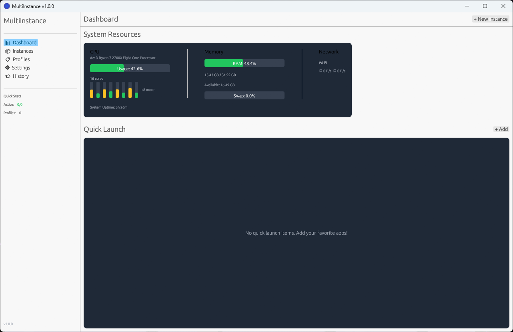
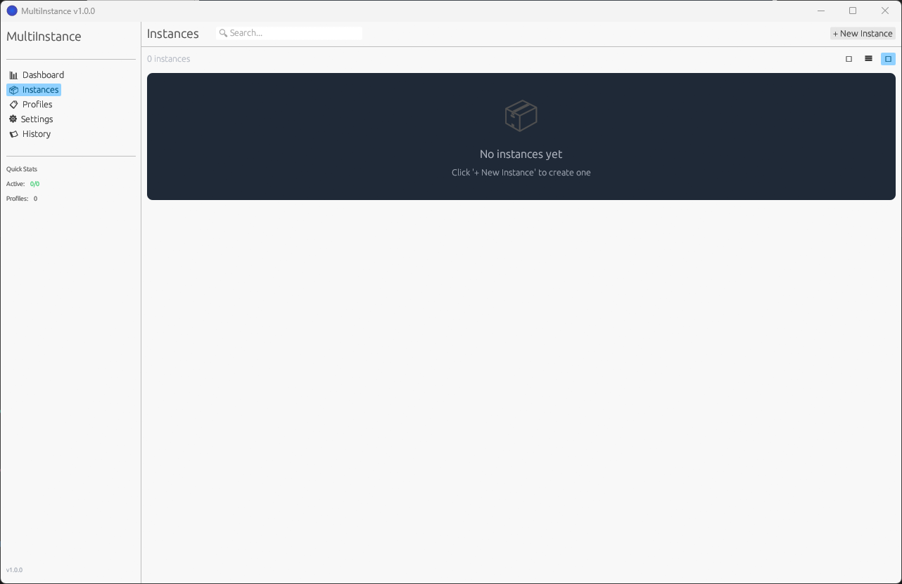

<p align="center">
  
</p>

# MultiInstance

Run multiple instances of single-instance applications.

A cross-platform desktop application built with Rust and egui that enables users to launch and manage multiple instances of applications that traditionally restrict themselves to a single instance.

## Features

- **Instance Bypass**: Launch unlimited instances of single-instance applications
- **Resource Control**: Allocate CPU, RAM, and network bandwidth per instance
- **Performance Monitor**: Real-time metrics dashboard for all running instances
- **Session Persistence**: Track and restore instance configurations after app restart
- **Profile Presets**: Save and load launch configurations for quick deployment

## Screenshots

### Dashboard


### Instance Management


## Installation

### Pre-built Binaries

Download the latest release for your platform:
- **Windows**: `MultiInstance-Setup.exe` or `MultiInstance-Portable.zip`
- **macOS (Intel)**: `MultiInstance-x64.dmg`
- **macOS (Apple Silicon)**: `MultiInstance-arm64.dmg`

### Building from Source

#### Prerequisites

- [Rust](https://rustup.rs/) 1.75 or later
- **Windows**: Visual Studio Build Tools 2019+ with C++ workload
- **macOS**: Xcode Command Line Tools (`xcode-select --install`)

#### Build Steps

```bash
# Clone the repository
git clone https://github.com/multiinstance/multiinstance.git
cd multiinstance

# Build in release mode
cargo build --release

# The binary will be at:
# Windows: target/release/multiinstance.exe
# macOS: target/release/multiinstance
```

#### macOS Build Scripts

For convenience, build scripts are provided in the `scripts/` directory:

```bash
# Build for your current Mac architecture and create .app bundle
./scripts/build-macos.sh

# Build universal binary (Intel + Apple Silicon) .app bundle
./scripts/build-macos-universal.sh
```

The scripts will create a proper `MultiInstance.app` bundle in the target directory.

#### Manual macOS Universal Binary Build

```bash
# Add both targets
rustup target add x86_64-apple-darwin aarch64-apple-darwin

# Build for both architectures
cargo build --release --target x86_64-apple-darwin
cargo build --release --target aarch64-apple-darwin

# Create universal binary
lipo -create \
  target/x86_64-apple-darwin/release/multiinstance \
  target/aarch64-apple-darwin/release/multiinstance \
  -output multiinstance-universal
```

## Usage

### Quick Start

1. Launch MultiInstance
2. Click "+ New Instance" in the top bar
3. Browse to select an application executable
4. Configure resource limits (optional)
5. Click "Create & Launch"

### Instance Management

- **Start/Stop**: Control instances from the dashboard or instance list
- **Pause/Resume**: Suspend instances to free up resources temporarily
- **Resource Limits**: Set CPU, memory, and network limits per instance
- **Auto-restart**: Enable automatic restart on crash

### Profiles

Save your instance configurations as profiles for quick deployment:

1. Go to Profiles tab
2. Click "+ New Profile"
3. Add instances to the profile
4. Use "Launch" to start all instances at once

### Keyboard Shortcuts

| Shortcut | Action |
|----------|--------|
| `Ctrl+N` | New Instance |
| `Ctrl+P` | New Profile |
| `Ctrl+,` | Settings |
| `Escape` | Close dialog |

## How It Works

MultiInstance uses several techniques to enable multi-instance execution:

### Windows
- **Profile Isolation**: Creates separate `APPDATA` directories for each instance
- **Environment Redirection**: Redirects `USERPROFILE`, `LOCALAPPDATA` to isolated paths
- **Resource Control**: Uses Windows Job Objects for CPU/memory limits
- **Process Priority**: Adjusts process priority class via Win32 API

### macOS
- **Home Directory Isolation**: Sets custom `HOME` for each instance
- **XDG Redirection**: Redirects `XDG_*` environment variables
- **Resource Limits**: Uses `setrlimit` for memory limits
- **Process Priority**: Adjusts nice value via `setpriority`

## System Requirements

| Requirement | Minimum | Recommended |
|-------------|---------|-------------|
| **Windows** | Windows 10 (64-bit) | Windows 11 |
| **macOS** | macOS 12 Monterey | macOS 14 Sonoma+ |
| **CPU** | Dual-core 2.0 GHz | Quad-core 3.0 GHz+ |
| **RAM** | 8 GB | 16 GB+ |
| **Storage** | 500 MB | SSD with 2 GB+ |

## Configuration

Settings are stored in:
- **Windows**: `%APPDATA%/MultiInstance/`
- **macOS**: `~/Library/Application Support/MultiInstance/`

Instance data directories:
- **Windows**: `%APPDATA%/MultiInstance/instances/`
- **macOS**: `~/Library/Application Support/MultiInstance/instances/`

## Troubleshooting

### Instance won't start

1. Verify the executable path is correct
2. Check if the application requires administrator privileges
3. Try disabling "Bypass single-instance check" for applications that don't need it

### High resource usage

1. Set CPU and memory limits in instance configuration
2. Reduce the number of concurrent instances
3. Lower the monitor update interval in settings

### Application data not isolated

Some applications use hardcoded paths. MultiInstance can't isolate these without additional techniques. Consider:
- Using the application's built-in multi-profile support if available
- Running instances in separate user accounts

## Contributing

Contributions are welcome! Please read our [Contributing Guide](CONTRIBUTING.md) for details.

## License

MIT License - see [LICENSE](LICENSE) for details.

## Acknowledgments

- [egui](https://github.com/emilk/egui) - Immediate mode GUI library
- [sysinfo](https://github.com/GuillaumeGomez/sysinfo) - System information library
- [rusqlite](https://github.com/rusqlite/rusqlite) - SQLite bindings

---

© 2025 MultiInstance. All rights reserved.
